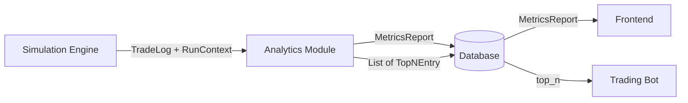
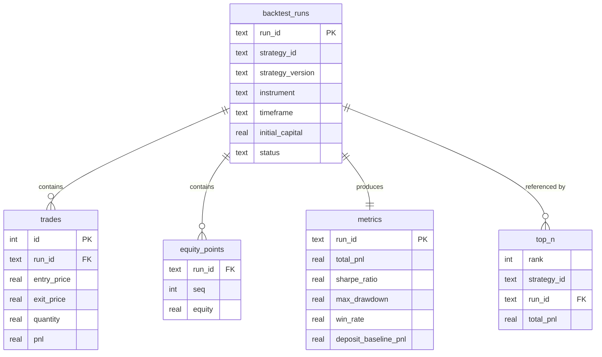

This document defines the data structures the Analytics Module consumes and produces, and how they are persisted. It complements `interfaces_description.md` (shared types) and `metrics_specification.md` (formulas, issue #35)

## Independence principle

The Analytics Module depends **only on the shared data contract**, never on Simulation Engine internals. It receives a plain `TradeLog` (plus a small `RunContext`), computes a `MetricsReport`, and writes rows to the database. It never imports engine code and never inspects how trades were produced. This is what lets the analytics layer be developed, tested, and replaced in isolation - a synthetic `TradeLog` is enough to exercise every metric

**Ownership split** (who writes what):

- Simulation Engine writes `backtest_runs`, `trades`, `equity_points`
- Analytics Module writes `metrics`, `top_n`
- Frontend and Trading Bot are read-only consumers

## Data flow

---

## 1. Trade log input format

What the Analytics Module receives from the Simulation Engine. `Trade` and `TradeLog` already exist in `interfaces.py`; `equity_curve` is a proposed addition

### `Trade` (existing)

|Field|Type|Description|
|---|---|---|
|`instrument`|`str`|Instrument the trade was executed on|
|`entry_price`|`float`|Price at which the position was opened|
|`exit_price`|`float`|Price at which the position was closed|
|`quantity`|`float`|Size of the position|
|`pnl`|`float`|Profit or loss for this trade (account currency)|
|`opened_at`|`datetime`|When the position was opened (UTC)|
|`closed_at`|`datetime`|When the position was closed (UTC)|

### `TradeLog`

|Field|Type|Description|
|---|---|---|
|`strategy_id`|`str`|Strategy that produced these trades|
|`instrument`|`str`|Instrument the run was executed on|
|`trades`|`List[Trade]`|Ordered list of completed trades|
|`final_portfolio_value`|`float`|Portfolio value at end of run|
|`equity_curve`|`List[float]` **(new)**|Mark-to-market portfolio value per candle, `E_0..E_T`. Basis for Sharpe and max drawdown|

### `RunContext` (new) - run identity / config

Run metadata that is not trade data but is needed by Analytics. Conceptually it is the `backtest_runs` row; passed alongside the `TradeLog`.

|Field|Type|Description|
|---|---|---|
|`run_id`|`str`|Unique run identifier (UUID)|
|`strategy_id`|`str`|Strategy identifier|
|`strategy_version`|`str`|Strategy version label (reproducibility)|
|`instrument`|`str`|Instrument|
|`timeframe`|`str`|Candle interval, e.g. `"1d"` (Sharpe annualization)|
|`period_start`|`datetime`|Backtest range start (UTC), `from_dt`|
|`period_end`|`datetime`|Backtest range end (UTC), `to_dt`|
|`initial_capital`|`float`|Starting capital `E_0` (returns, drawdown, deposit baseline)|

---

## 2. Metrics schema (output)

`MetricsReport` is produced by the Analytics Module from a `TradeLog`. Fields match `interfaces.py` exactly; formulas are in `metrics_specification.md`.

|Field|Type|Range / unit|Description|
|---|---|---|---|
|`strategy_id`|`str`|—|Strategy these metrics belong to|
|`instrument`|`str`|—|Instrument the metrics were computed for|
|`total_pnl`|`float`|account currency|Sum of P&L across all trades|
|`sharpe_ratio`|`float`|unbounded|Annualized risk-adjusted return|
|`max_drawdown`|`float`|`[0, 1]`|Largest peak-to-trough decline (positive fraction)|
|`win_rate`|`float`|`[0, 1]`|Fraction of profitable trades|
|`deposit_baseline_pnl`|`float`|account currency|P&L of the 13% deposit over the same period|

On persistence, `run_id` and `computed_at` are added (see `metrics` table).

---

## 3. Top-N output format

The ranking step keeps strategies whose `total_pnl > deposit_baseline_pnl`, sorts them by `total_pnl` descending, and assigns ranks. The result is a list of `TopNEntry`, persisted to the `top_n` table and read by the Trading Bot.

### `TopNEntry` (new)

|Field|Type|Description|
|---|---|---|
|`rank`|`int`|1-based position in the ranking (1 = best)|
|`strategy_id`|`str`|Strategy identifier|
|`instrument`|`str`|Instrument|
|`run_id`|`str`|Run that produced the ranked metrics|
|`total_pnl`|`float`|P&L used as the sort key|
|`computed_at`|`datetime`|When this ranking was produced|

The whole `top_n` table is **replaced atomically** on each recalculation. On a failed recalculation it is left untouched, and the Trading Bot keeps using the last successful ranking (fault-tolerance rule from the product description)

---

## 4. Database fields

