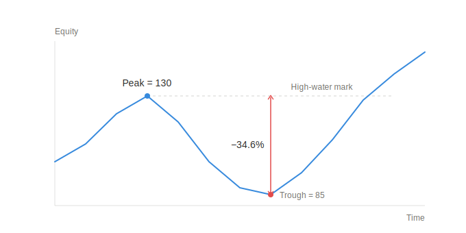
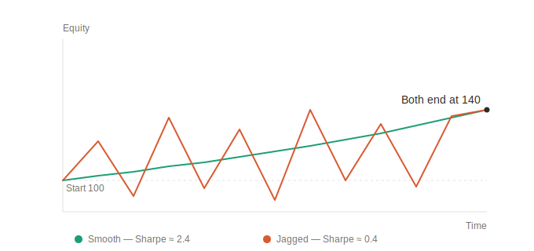

# Core Performance Metrics — Specification

This document specifies the **exact formulas and calculation rules** for the first set of performance metrics produced by the Analytics Module.

Implementation status: **audited against `src/analytics/metrics.py` and tests on
June 23, 2026**.

## Scope - "computed using only Candles"

The first metric set is computed exclusively from **candle-derived data**:

- the `TradeLog` produced by the Simulation Engine while iterating over a `List[Candle]`, and
- candle **close** prices, used to mark the portfolio to market.

No order-book, tick-level, or sentiment data is used. This matches MVP-1 (one strategy, one instrument, long-only).

The four metrics in the Definition of Done map directly onto `MetricsReport`:

|`MetricsReport` field|Metric|
|---|---|
|`total_pnl`|P&L|
|`sharpe_ratio`|Sharpe ratio|
|`max_drawdown`|Max drawdown|
|`win_rate`|Win rate|

`deposit_baseline_pnl` is also specified here because the top-N filter depends on it, but it is a **comparison baseline**, not a performance metric.

---

## Inputs

The Analytics Module needs the following per run. `equity_curve` is now part of
`TradeLog`; the remaining run metadata is supplied through `RunContext`.

|Input|Source|Used by|
|---|---|---|
|`trades: List[Trade]`|`TradeLog`|P&L, win rate, fallback equity curve|
|`final_portfolio_value: float`|`TradeLog`|consistency check|
|`initial_capital: float`|`RunContext`|returns, drawdown, deposit baseline|
|`equity_curve: List[float]`|`TradeLog`|Sharpe, max drawdown|
|`timeframe: str`|strategy config / candle|annualization|
|`period_start`, `period_end: datetime`|candle range (`from_dt`, `to_dt`)|deposit baseline, periods/year|

### Equity curve

The **equity curve** `E = [E_0, E_1, ..., E_T]` is the portfolio value evaluated at every candle, marked to market on the candle close:

```
E_0 = initial_capital
E_i = cash_i + Σ_p ( position_quantity_p × candle_i.close_p )      (i = 1..T)
```

For MVP-1 (single instrument, long-only) this reduces to:

```
E_i = cash_i + held_quantity_i × candle_i.close
```

This curve is the canonical basis for Sharpe and max drawdown.

**Fallback API:** `fallback_equity_curve()` can reconstruct a coarse, realized-only curve
stepping at each closed trade when an external caller does not provide the engine curve:

```
E_0      = initial_capital
E_k      = initial_capital + Σ_{j ≤ k} trades[j].pnl
```

The fallback ignores unrealized intra-trade fluctuations, so it under-reports drawdown and
changes the Sharpe sampling frequency from per-candle to per-trade. The integrated engine
already emits the preferred per-candle curve.

---

## Shared conventions

- **Per-trade P&L** is produced by the Simulation Engine, not the Analytics Module. For consistency the assumed convention (long-only MVP) is:

    ```
    trade.pnl = (exit_price − entry_price) × quantity − commission
    ```

    The current engine does not model commission. It therefore behaves as if commission is
    `0.0`; commission is not currently configurable.

- A trade is a **win** when `pnl > 0`. Break-even (`pnl == 0`) is **not** a win.

- All amounts are in account currency; `max_drawdown` and `win_rate` are unitless fractions in `[0, 1]`.

- Empty / degenerate inputs return the neutral values defined per metric below (never raise, never return `NaN`), so a strategy that never trades is still rankable.

---

## 1. P&L - `total_pnl`

Sum of realized profit/loss across all closed trades:

```
total_pnl = Σ_{t ∈ trades} t.pnl
```

- Empty trade list → `total_pnl = 0.0`.

- **Rule:** any position still open at the last candle is force-closed by the Simulation Engine at that candle's close, so realized P&L equals net P&L and the metric is unambiguous. With this rule:

    ```
    total_pnl  ==  final_portfolio_value − initial_capital     (consistency check)
    ```

    The Analytics Module asserts this equality (within a small float tolerance) and raises a data-integrity alert if it fails.

---

## 2. Win rate - `win_rate`

Fraction of profitable trades:

```
wins      = | { t ∈ trades : t.pnl > 0 } |
n_trades  = | trades |
win_rate  = wins / n_trades
```

- `n_trades == 0` → `win_rate = 0.0`.
- Result is in `[0.0, 1.0]`, matching `MetricsReport.win_rate`.

---

## 3. Max drawdown - `max_drawdown`

Largest peak-to-trough decline of the equity curve, as a **positive fraction** relative to the running peak (e.g. `0.15` = 15%).

Given the equity curve `E_0 .. E_T`:

```
peak_i        = max(E_0, E_1, ..., E_i)                 (running maximum)
drawdown_i    = (peak_i − E_i) / peak_i
max_drawdown  = max_i ( drawdown_i )
```

- Denominator is the **running peak** (relative drawdown), not initial capital.
- Fewer than 2 equity points, or a flat/monotonically rising curve → `max_drawdown = 0.0`.
- `initial_capital > 0` is assumed, so `peak_i > 0` and the division is safe. If a peak is ever `≤ 0` (only possible with leverage, out of MVP scope), that point is skipped.
- Result is in `[0.0, 1.0]`, matching `MetricsReport.max_drawdown`



---

## 4. Sharpe ratio - `sharpe_ratio`

Annualized risk-adjusted return, computed from **per-period simple returns** of the equity curve.

**Step 1 - period returns** (i = 1..n, n = T):

```
r_i = (E_i − E_{i−1}) / E_{i−1}
```

**Step 2 - excess returns** over the per-period risk-free rate `r_f`:

```
x_i = r_i − r_f
```

**Step 3 - mean and sample standard deviation** (n − 1 denominator):

```
mean_x = (1/n) · Σ x_i
std_x  = sqrt( (1/(n−1)) · Σ (x_i − mean_x)^2 )
```

**Step 4 - per-period Sharpe, then annualize**:

```
sharpe_period = mean_x / std_x
sharpe_ratio  = sharpe_period × sqrt(periods_per_year)
```



### Parameters and rules

- **Risk-free rate `r_f`:** the current default is `0.0`. When callers pass `None`, the
  implementation derives a per-period rate from the annual deposit baseline (13%/year):

    ```
    r_f = (1 + 0.13)^(1 / periods_per_year) − 1
    ```

    This behavior is configurable through `MetricsConfig.risk_free_rate`.

- **`periods_per_year`** depends on `timeframe` and the traded calendar. Defaults (configurable, MOEX-oriented):

    |timeframe|periods_per_year|
    |---|---|
    |`1d`|252|
    |`1h`|252 × trading_hours_per_day|
    |`1m`|252 × trading_hours_per_day × 60|

    Using a fixed `periods_per_year` keeps Sharpe comparable across strategies on the same timeframe.

- **Standard deviation** uses the sample estimator (n − 1). This is a deliberate choice; switching to the population estimator (n) must be a team-wide decision so all strategies are ranked on the same basis.

- **Edge cases:** `n < 2` → `sharpe_ratio = 0.0`; `std_x == 0` (no variation) → `sharpe_ratio = 0.0`.

- Simple returns are used. Log returns are a possible later refinement but change the numbers, so they are out of scope for the first set.

---

## Comparison baseline - `deposit_baseline_pnl`

P&L the same capital would have earned in a bank deposit over the same period (compound, 13% annual):

```
years                 = (period_end − period_start) / 365 days
deposit_baseline_pnl  = initial_capital × ( (1 + 0.13)^years − 1 )
```

- `years` is measured over the **candle range actually backtested** (`period_start = from_dt`, `period_end = to_dt`).
- The top-N filter keeps a strategy when `total_pnl > deposit_baseline_pnl` (ranking logic lives in the Analytics ranking step, not in this metric).
- The annual rate `0.13` is a single configurable constant shared across the module.

---

## Edge-case summary

|Situation|total_pnl|win_rate|max_drawdown|sharpe_ratio|
|---|---|---|---|---|
|No trades|0.0|0.0|0.0|0.0|
|< 2 equity points|—|—|0.0|0.0|
|Flat / rising equity|—|—|0.0|0.0 (if std = 0)|
|Zero return variance|—|—|as computed|0.0|

No metric raises an exception or returns `NaN`; a failing consistency check raises a **data-integrity alert** instead of corrupting the metric.

---

## Configuration parameters

|Parameter|Default|Description|
|---|---|---|
|`initial_capital`|run config|Starting capital `E_0`|
|`commission`|not implemented|Current engine applies no trading costs|
|`annual_deposit_rate`|`0.13`|Baseline deposit / risk-free source|
|`risk_free_rate`|`0.0`; `None` derives from annual rate|Per-period `r_f` in Sharpe|
|`periods_per_year`|per timeframe table|Sharpe annualization factor|
|`trading_hours_per_day`|venue-dependent|Used to derive `periods_per_year`|

---

## Resolved and Remaining Coordination Points

Resolved:

1. `TradeLog` now contains `equity_curve`.
2. `RunContext` supplies `initial_capital`, timeframe, period, strategy, and instrument.
3. Sharpe uses sample standard deviation.
4. Open long positions are force-closed on the final candle.

Remaining:

1. Add commissions/slippage before results are treated as realistic execution estimates.
2. Align supported timeframes between strategy configuration and the T-Bank adapter.
3. Decide whether the default Sharpe risk-free rate remains `0.0` or derives from the
   deposit baseline.
4. Persist run inputs and equity curves for durable reproducibility.
5. Add percentage return and risk/reward metrics requested in the June 22 review.

---

## MVP-1 implementation notes

Implemented in `src/analytics/metrics.py`.

Public API:

- `calculate_total_pnl(trades)` — sums realized closed-trade P&L.
- `calculate_win_rate(trades)` — counts trades where `pnl > 0`; break-even trades are not wins.
- `calculate_max_drawdown(equity_curve)` — computes the largest running peak-to-trough decline as a positive fraction.
- `calculate_sharpe_ratio(equity_curve, timeframe)` — computes annualized Sharpe from simple per-period equity returns with sample standard deviation.
- `calculate_deposit_baseline_pnl(initial_capital, period_start, period_end)` — computes the 13% annual compound deposit baseline.
- `calculate_metrics(...)` — returns a full `MetricsReport`.
- `calculate_metrics_from_trade_log(trade_log, context)` — canonical Analytics entry point for `TradeLog + RunContext`.

Simulation Engine changes for Analytics MVP-1:

- `ExecutionEngine.run(...)` now returns `equity_curve` in addition to the existing `trade_log` and `final_portfolio` keys.
- `ExecutionEngine.run(...)` also returns `trade_log_report`, a `TradeLog` dataclass with `trades`, `final_portfolio_value`, and `equity_curve`.
- Any still-open long position is force-closed on the last candle close. This keeps the Analytics consistency rule true: `total_pnl == final_portfolio_value - initial_capital`.

Edge-case behavior:

- Empty trade list returns neutral values for trade-based metrics.
- Fewer than two equity returns or zero return variance returns `sharpe_ratio = 0.0`.
- Flat or monotonically rising equity returns `max_drawdown = 0.0`.
- No metric returns `NaN`.
- `DataIntegrityError` is raised if a supplied `final_portfolio_value` is inconsistent with realized P&L beyond tolerance.

Tests are in `tests/unit/analytics/test_analytics.py` and can be run with:

```bash
python -m pytest tests/unit/analytics/test_analytics.py -q
```
