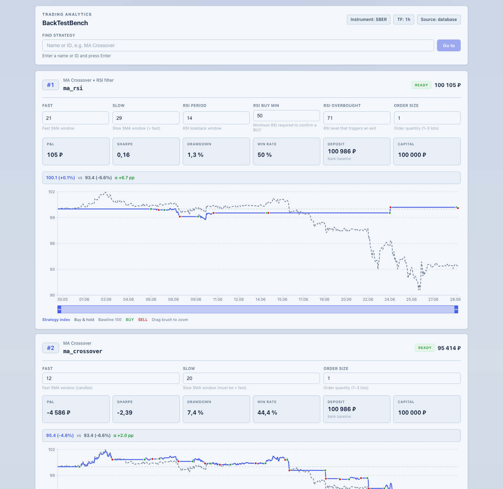
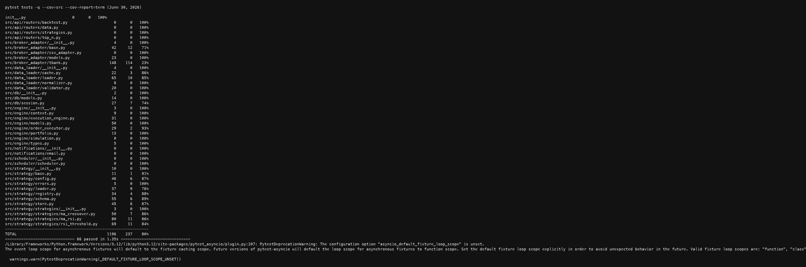
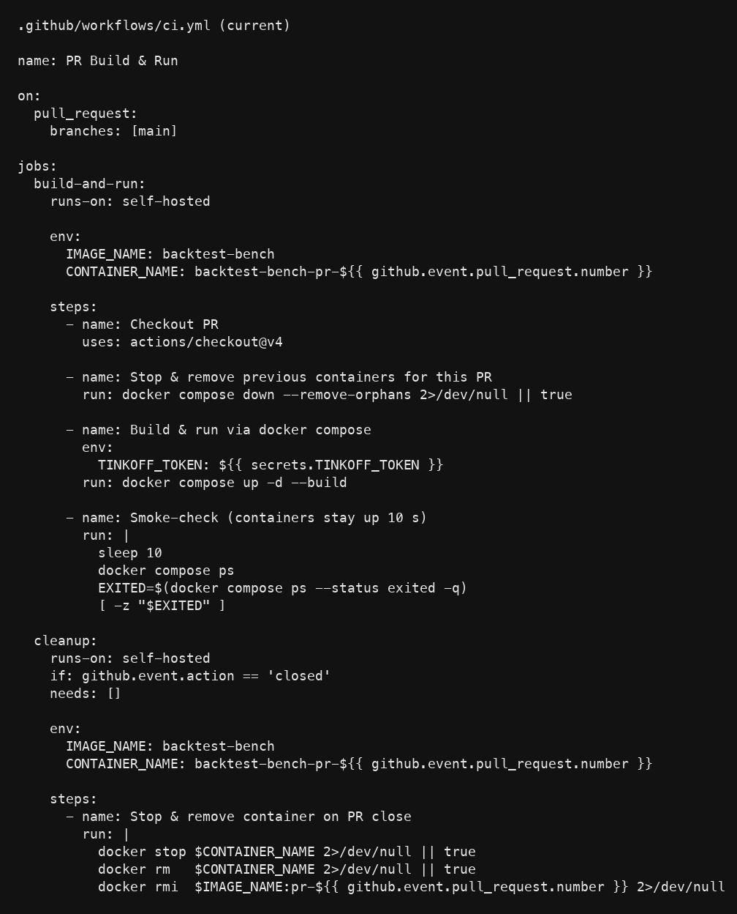

# Week 4 Report
Validation Pipeline, Extensibility & Ranking

Course: [Sum26] Practicum Project  
Project: BackTestBench: modular backtesting and sandbox platform for trading strategies  
Track: Industrial  
TA: Gerald Imbugwa  
Customer: Alexey Potemkin  
Date: 30.06.2026

## 1. Team Information

- Team name: BackTestBench
- Primary communication channel: https://t.me/Muratich_29
- Marat Diiarov — Team lead, reports and customer communication, frontend.
- Georgii Beliaev — Tech lead, requirements and architecture, DevOps/QA.
- Bogdan Zinchenko — Data engineering and historical data management.
- Samy Badavi — Simulation Engine development.
- Maxim Kharlamov — Analytics and ranking.
- Philip Oghenerukevwe Idiare — Strategy Module.
- Nikolay Taran — Broker Adapter and T-Bank integration.

## 2. Project and Track Statement

BackTestBench is an industrial-track project for testing trading strategies on historical Russian market data. After Week 3 delivered the first integrated MVP (single hardcoded MA Crossover run), Week 4 focused on extensibility, strategy comparison, ranking, data-loader improvements, and a more usable dashboard.

By June 30, 2026 the repository supports three built-in strategies, YAML/JSON-driven parameter schemas, in-memory Top-N ranking on backtest metrics, a multi-strategy dashboard with editable parameters, benchmark comparison on the chart, buy/sell markers, SQLite-backed candle storage with basic input checks and cache reuse, configurable instrument/timeframe/lookback via `config/dashboard.json`, and a recorded demo video. A separate validation-metrics library was added for future second-stage evaluation, but an end-to-end validation workflow is not yet integrated into `main.py` or the UI.

## 3. Week 4 Goal, Scope, and Milestone Status

### Planned goal (from Week 2 roadmap)

Transform the MVP into a more extensible research platform: extend the Strategy Module and Analytics Module, expose ranking results to users, and strengthen the data path. The Week 2 roadmap also called for foundations of automated recalculation and validation workflows; Week 4 delivered ranking plus a validation-metrics **library**, while the full validation run pipeline remains planned for Week 5.

## 4. Implementation Summary

### 4.1 Strategy extensibility (issues #43, #44, #45, #94 — PR #98)

- Auto-discovery of built-in plugins under `src/strategy/strategies/`.
- Runtime loading via `load_plugin_file()` / `load_plugins_from_dir()`.
- New strategies: `ma_rsi`, `rsi_threshold` with YAML configs in `config/strategies/`.
- `ParameterSpec` schema drives dashboard forms without hardcoded per-strategy UI.
- Per-strategy parameter validation before simulation starts.
- Documentation: `docs/strategy_module_plugins_and_configuration.md`, `docs/strategy_signal_and_position_rules.md`.
- Tests: `test_loader.py`, `test_config_interface.py`, `test_ma_rsi.py`, `test_rsi.py`.

### 4.2 Top-N ranking and validation metrics foundation (issues #48, #49 — PR #100)

**Ranking (integrated):**

- Extended `src/analytics/ranking.py` with documented sort order (P&L vs deposit baseline, drawdown, Sharpe, win rate, deterministic tie-break).
- Top-N is consumed by the dashboard ranking panel (PR #102) and ranks **backtest** results from completed strategy runs.
- Expanded unit tests in `tests/unit/analytics/test_analytics.py`.
- Updated `docs/analytics_data_model_specification.md` and `docs/core_perfomance_metrics.md`.

**Validation metrics (library only — not a live workflow yet):**

- Added `src/analytics/validation.py` with `ValidationMetricsReport`, separate in-memory backtest/validation buckets, and `calculate_validation_metrics_from_trade_log()`.
- `RankingReviewEntry` can attach optional validation metrics for future review UI.
- **Not integrated:** `main.py` does not run a second validation pass; the dashboard does not display validation metrics; there is no scheduler or holdout dataset workflow.
- Issue #49 DoD (validation metrics supported at analytics layer) is met in code and tests; the broader Week 2 “validation workflow” (automated second-stage evaluation) is **backlog for Week 5**.

### 4.3 Dashboard customization and multi-strategy runs (issue #50 — PR #101, #102)

- Configurable `config/dashboard.json` and per-strategy `POST /api/run-strategy`.
- Dashboard renders parameter editors from `parameter_specs` returned by the backend.
- Chart shows strategy index vs buy-and-hold benchmark (normalized to 100) with buy/sell markers.
- `main.py` orchestrates multiple strategies against shared candle data.
- Ranking table with search and `POST /api/refresh-ranking`.
- `order_size` capped at 3 lots after stability issues with larger sizes (commit `34dba46`).

### 4.4 Data path: input checks, normalization, cache (issues #26, #27 — PR #104)

- `validate_candles()` in `src/data_loader/validator.py` rejects empty lists, null OHLC values, and invalid volume before storage (basic input guard, not the full duplicate/missing-value pipeline described in issue #26).
- `DataLoader` normalizes broker candles into `CandleModel` rows with upsert on `(instrument, timeframe, timestamp)`.
- SQLite-backed reuse: `db_candles_usable()` skips broker fetch when the DB already covers the lookback window.
- Optional in-memory `CandleCache` for hot instrument/timeframe pairs.
- Tests in `tests/unit/data_loader/test_loader.py`.
- **Partial vs issue #26:** duplicate detection and missing-value handling beyond pre-storage OHLC checks remain follow-up work.

### 4.5 Configurable assets and lookback (issue #25 — PR #103)

- `config/dashboard.json` exposes `instrument`, `timeframe`, `initial_capital`, and `lookback_days` without code changes.
- Strategy YAML files carry per-strategy instrument/timeframe defaults.
- Default demo remains SBER / 1h / 30 days; switching instrument or timeframe is a configuration change, not an engine rewrite.
- Multi-asset UI selection is deferred to Week 5; the data and loader path already accept arbitrary instrument identifiers resolved by the T-Bank adapter.

### 4.6 Engine multifunctionality (issue #47)

- `main.py` runs each configured strategy with independent parameters on the same normalized candle series.
- Fresh broker data is fetched only when SQLite cache does not cover the requested window.
- Each strategy produces its own metrics, chart points, and ranking entry; the execution engine and portfolio model are reused unchanged.
- Integration tests in `tests/integration/test_strategy_engine_integration.py` cover multiple strategy IDs.

### 4.7 Demo video and report (issues #54, #57)

- Demo video recorded for the course platform: dashboard load, parameter edit, strategy run, metrics/chart update, and ranking refresh.
- Week 4 report delivered printable PDF with embedded screenshots.

## 5. Updated API Surface

Implemented Week 4 routes (Next.js):

- `GET /api/dashboard` — multi-strategy state, metrics, chart points, ranking block.
- `POST /api/run-strategy` — run one strategy with posted parameters.
- `POST /api/refresh-ranking` — rebuild Top-N from completed runs.
- `GET /api/bootstrap` — initial dashboard configuration.

The Week 3 `POST /api/run` single-pipeline route was removed in PR #101.

Planned FastAPI contract in `docs/api_description.md` remains target architecture, not the live integration path.

## 6. Industrial Track Contribution

Week 4 moved the product from a single demo script toward a research-oriented platform slice:

- **Extensibility:** new strategies added as plugins without engine changes.
- **Comparability:** three strategies on the same SBER / 1h / ~30-day window with shared benchmark line.
- **Ranking:** explicit Top-N ordering on backtest metrics, consumed by the UI (customer demo on June 29 confirmed ranking is live).
- **Validation foundation:** analytics module can store and compare validation metrics separately from backtest metrics in memory, ready for a future second-stage run — not yet wired into the product flow.
- **Data reliability:** normalized, cached candles reduce repeated broker calls; basic OHLC/volume checks reject corrupt inputs before storage.

Demonstration snapshot (June 30, 2026, `data/runtime-dashboard.json`):

- Instrument: SBER, timeframe: 1h, initial capital: 100,000 RUB.
- `ma_rsi`: +104.76 RUB realized P&L (rank #1).
- `ma_crossover`: −4,586.23 RUB.
- `rsi_threshold`: −5,184.95 RUB.
- Values depend on T-Bank data window and are not stable profitability claims.

## 7. Screenshots / Demo Evidence

### Multi-strategy dashboard (desktop, June 30, 2026)

### Backend test and coverage evidence

### CI workflow (self-hosted PR smoke check)

## 8. Customer Review and Feedback

### Review date

Expanded dashboard demonstrated to the customer on **29.06.2026** (`transcriptions/29-06-26-customer.txt`).

### Positive confirmation

- End-to-end flow works with candle data, metrics, chart, and ranking.
- Benchmark line and buy/sell markers improve interpretability.
- MA + RSI ranked best in the demonstrated parameter set; first profitable run on the current window was shown.

### Customer direction for Week 5

The June 29 session confirmed that the **primary product goal** is a **flexible strategy system**, not further polishing of rigid per-strategy UI forms. The dashboard should remain mainly a **visualizer** (metrics, charts, ranking, search); new mechanisms should be added through **files and/or a composable engine** without rewriting the backtester, bot layer, or core pipeline.

### Follow-ups for Week 5 (prioritized)

**Primary — flexible strategy architecture**

1. Design and spike a **trigger/action strategy abstraction**: indicators → triggers → actions; separate entry and exit criteria; composable blocks (e.g. shared TP/SL, trailing stop) instead of hardcoded strategy classes.
2. Expose **take-profit / stop-loss** (and related exit rules) as first-class, editable strategy parameters within that model — the customer treats exit logic as more important than entry filters.
3. Keep strategy definition **file/config-driven**; avoid adding new hardcoded form fields in the frontend for each strategy.

**Second track — search for best parameters**

4. Add a discrete-grid **parameter optimizer** (grid search over realistic value sets, not brute-force 0..100) for at least one existing strategy.

**Supporting UX (do not block architecture work, but fix misleading behaviour)**

5. Add explicit **Calculate / Run** — stop auto-recalculating on every parameter keystroke.
6. Freeze **ranking** updates until the user submits a complete parameter set.

**Lower priority**

7. Improve chart zoom usability; investigate `order_size` stability above 3 lots.
8. Multi-instrument UI selection (configuration path exists; picker UI deferred).

June 22 feedback on configurable inputs, markers, ranking, and reusable data was partially addressed in Week 4; full strategy flexibility and exit-parameter ownership remain the main Week 5 focus.

## 9. Updated Backlog

### Completed in Week 4

- Strategy plugins, parameter validation, and configuration interface (#43, #44, #45, #94).
- Top-N ranking on backtest metrics (#48) and ranking UI (PR #102).
- Validation metrics **analytics module** (#49) — library and tests, not end-to-end workflow.
- Frontend strategy customization (#50).
- Data loader normalization, cache reuse, basic candle input checks (#27; #26 partial).
- Configurable instrument/timeframe/lookback (#25).
- Multi-strategy engine path (#47).
- Demo video (#54) and Week 4 report (#57).

### Next priority (Week 5)

- **Flexible strategy system (P0):** trigger/action abstraction spike, composable exit rules, TP/SL as first-class parameters, file/config-driven strategies — UI stays a visualizer.
- **Parameter optimizer (P1):** discrete-grid search for at least one strategy.
- **UX fixes (P1, supporting):** explicit Run/Calculate, ranking freeze until submit completes.
- **Validation workflow:** second-stage validation run, holdout/fresh-data path, exposure of validation metrics.
- Full data validation pipeline (#26 remaining DoD: duplicates, missing values).
- Multi-instrument UI picker and broker request splitting for large ranges.
- Scheduler, notifications, and MVP-2 integration items from the Week 5 milestone.

### Deferred

- Multi-broker adapter, visual strategy builder, full relational run-history persistence.

## 10. Required Links

Repository and planning:

- Repository: https://github.com/BackTest-bench-team/BackTestBench
- Kanban board: https://github.com/orgs/BackTest-bench-team/projects/1
- Issues: https://github.com/BackTest-bench-team/BackTestBench/issues
- Milestone Week 4: https://github.com/BackTest-bench-team/BackTestBench/milestone/4

Pull requests merged this week:

- #98 — Strategy plugins, RSI, MA+RSI, config interface
- #100 — Top-N ranking and validation metrics module
- #101 — Frontend customization, data loader, multi-strategy pipeline
- #102 — Top-N ranking panel and search
- #103 — Expand assets assortment and customizable instrument/timeframe usage (`examples/README.md`, `tbank_adapter_usage.py`)
- #104 — Data normalization and validation pipeline (`normalizer.py`, extended `validator.py`, `test_validator.py`; closes #26, #27)

All Week 4 milestone issues tracked on the board: #25, #26, #27, #43, #44, #45, #47, #48, #49, #50, #54, #57, #94

Documentation:

- Strategy plugins: `docs/strategy_module_plugins_and_configuration.md`
- Analytics model: `docs/analytics_data_model_specification.md`
- Customer notes: `transcriptions/29-06-26-customer.txt`

## 11. Verification

Commands run on June 30, 2026:

- Backend: **66 tests passed** — `pytest tests -q` (after PR #104 merge).
- Coverage: **80%** of `src/` — `pytest tests --cov=src --cov-report=term` (June 30 snapshot; re-run after #104 for updated count).
- Frontend: **production build succeeded** after `npm ci` — Next.js 16.2.9; routes `/`, `/api/bootstrap`, `/api/dashboard`, `/api/run-strategy`, `/api/refresh-ranking`.
- CI: self-hosted PR Docker smoke workflow (see screenshot above).

Non-blocking warnings:

- `pytest-asyncio` default fixture loop scope deprecation warning.
- Next.js workspace-root inference warning (multiple lockfiles).
- `npm audit` reports moderate dependency advisories.

## Conclusion

Week 4 advanced the Extensibility & Ranking milestone: plugin strategies, configuration interface, Top-N ranking in the UI, a multi-strategy dashboard with benchmark visualization, data-loader normalization with cache reuse, configurable run context, and multi-strategy engine execution. Validation is represented by a separate analytics library (`src/analytics/validation.py`) and tests, but not yet by an automated backtest→validation workflow in the live product.

The June 29 customer review validated the product direction while setting Week 5 priorities around **flexible, composable strategy design** (trigger/action model, TP/SL exit rules, file-driven configuration), parameter optimization, and supporting UX fixes — not expansion of rigid per-strategy dashboard forms.
